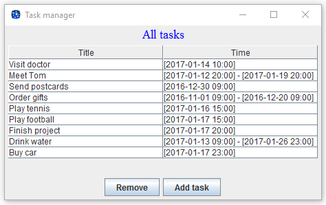
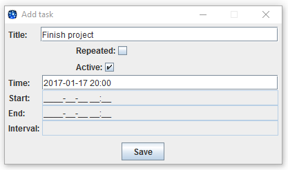
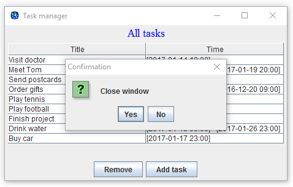

#Task manager
***
Task manager - це додаток, який дозволяє планувати задачі одноразово або на певний проміжок часу. 
Метою проекту було практичне застосування мови Java.

Протягом виконнаня мною було освоєно та імплементовано наступні техніки:
* власні реалізації структур даних: ArrayList та LinkedList;
* ітератори;
* робота з файловою системою;
* графічний інтерфейс з використанням Swing;
* збірка та запуск проекту використовуючи javac, jar, java;
* документація, утиліта javadoc.

Було застосовуно наступні патерни проектування: MVC, Observer, Decorator, Factory method.

Завдання та юніт тести були взяті [тут](./samples/assignment.pdf).

####Збірка і запуск проекту
Для збірки проекту необхідно мати OC Windows з установленою JDK 8.

Для запуску потрібно виконати з консолі команду [run.bat](./run.bat) - вона зкомпілює, 
створить jar архів та запустить додаток.

Для запуску тестів використовується команда [run-test.bat](./run-test.bat), яка відповідно компілює проект, 
збирає jar архів, компілює тестові класи, створює окремий jar архів та запускає тести.

Команда [docs.bat](./docs.bat) генерує документацію.

####Функціонал

#####На даний момент доступні можливості:
* створення одноразових та повторюваних задач;
* видалення задач;
* збереження даних між запусками у файлову систему.

#####Наступний функціонал буде імплементовано найближчим часом:
* сповіщення користувача;
* календар запланованих подій на деякий проміжок часу.

#####Інтерфейс
1. Головне вікно додатку 

2. Вікно створення задачі. Одноразової

або ж повторюваної.

3. Для видалення задачі необхідно спочатку її виділити та натиснути _Remove_.

4. Вікно закриття додатку.

.