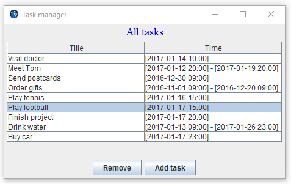

#Додаток "Task manager"
***
##Для чого додаток потрібний?
---
Даний додаток створювався відповідно до [завдань](./samples/assignment.pdf).

#####На даний момент в додатку можна:
* зберігати дані між запусками у файловій системі;
* створювати нові задачі;
* видаляти задачі.

#####В найближчий час планується зробити щоб додаток робив наступне:
* сповіщати користувача в момент, коли деяка задача має бути виконана;
* змінювати параметри існуючих задач;
* переглядати інформацію про існуючі задачі;
* переглядати календар запланованих подій на деякий проміжок часу.

##Як користуватися додатком?
---
1. Спочатку необхідно запустити [файл](./run.bat).

2. Відкриється головне вікно додатку 

3. Натиснувши кнопку _Add task_, Ви можете додати не повторювану задачу

або ж повторювану

заповнивши при цьому всі необхідні поля.

4. Якщо Вам необхідно видалити задачу зі списку, то виділяєте необхідну задачу

і тисните _Remove_.

5. Під час закриття додатку Вам необхідно підтвердити чи справді Ви хочете вийти з додатку

.

Якщо _Yes_, тоді всі зміни будуть збережені до наступного сеансу.
В іншому випадку Ви повернетесь в головне вікно додатку.